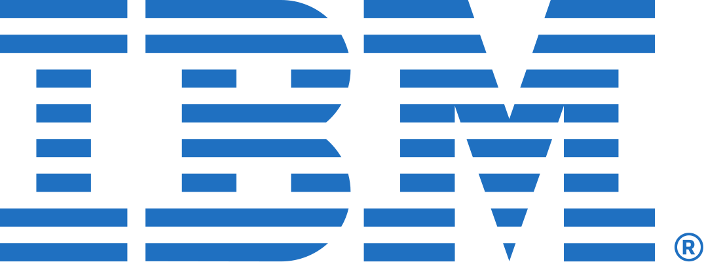

---
# Leave the homepage title empty to use the site title
title:
date: 2025-09-03
type: landing

sections:

  - block: markdown
    content:
      title: ""
      text: |
        

          

            
HCMI Lab / Toronto Metropolitan University

            <h1>Human-Centered Machine Intelligence</h1>
            
The HCMI Lab at Toronto Metropolitan University explores how to build intelligent systems that work for people.

            

              <a class="home-btn home-btn-primary" href="/publication/">Our Research</a>
              <a class="home-btn home-btn-ghost" href="#home-focus">Learn More</a>
            

          

          

            
            
                SCROLL
               
            
          

        

    design:
      columns: '1'
      background:
        color: '#FFFFFF'
      spacing:
        padding: ['0', '0', '0', '0']
      css_class: home-hero

  - block: home-news
    content:
      title: ""
    design:
      columns: '1'
      background:
        color: '#FFFFFF'
      spacing:
        padding: ['0', '0', '0', '0']
      css_class: home-news

  - block: markdown
    content:
      title: ""
      text: |
        

          

            
Our Focus

            <h2>Building AI that understands and supports human life.</h2>
            
We bring together computer science, psychology, design, and the humanities to create intelligent systems that are fair, transparent, and aligned with human values.

            <a class="home-btn home-btn-ghost home-btn-dark" href="/publication/">Learn more →</a>
          

          

            <svg class="home-focus-lines" viewBox="0 0 560 420" preserveAspectRatio="none">
              <line x1="300" y1="110" x2="170" y2="250"></line>
              <line x1="330" y1="120" x2="430" y2="270"></line>
            </svg>
            

              <h3>Human Values</h3>
              
fairness transparency trust

            

            

              <h3>Real-World Impact</h3>
              
well-being opportunity

            

            

              <h3>Machine Intelligence</h3>
              
learning reasoning adaptation

            

          

        

    design:
      columns: '1'
      background:
        color: '#F7F8FA'
      spacing:
        padding: ['0', '0', '0', '0']
      css_class: home-focus

  - block: home-linkedin
    content:
      title: ""
    design:
      columns: '1'
      background:
        color: '#FFFFFF'
      spacing:
        padding: ['0', '0', '0', '0']
      css_class: home-posts

  - block: markdown
    content:
      title: ""
      text: |
        

          <h2>Our past and current Research Collaborators</h2>
          
Our past and current collaborators

          

            
            
            
            
            
            
            
          

        

    design:
      columns: '1'
      background:
        color: '#FFFFFF'
      spacing:
        padding: ['0', '0', '0', '0']
      css_class: home-collaborators
---
